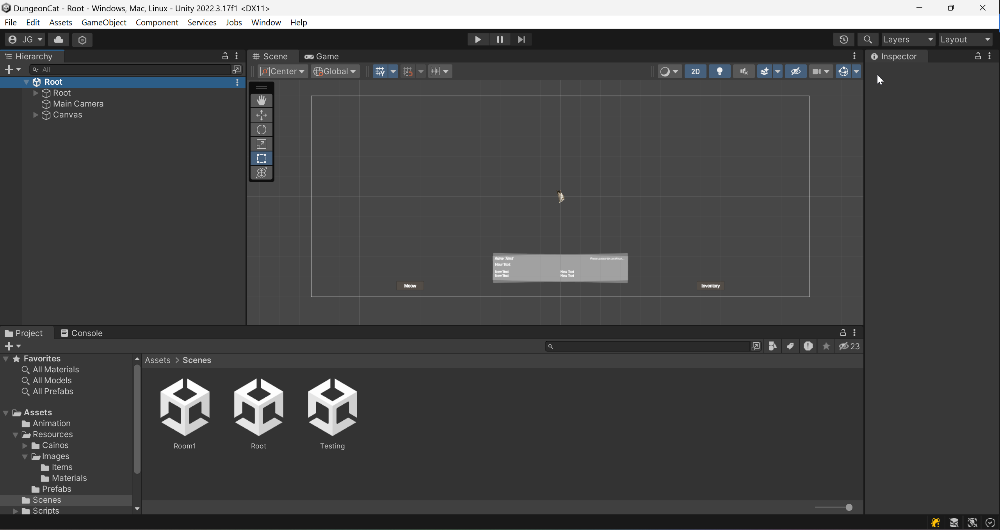
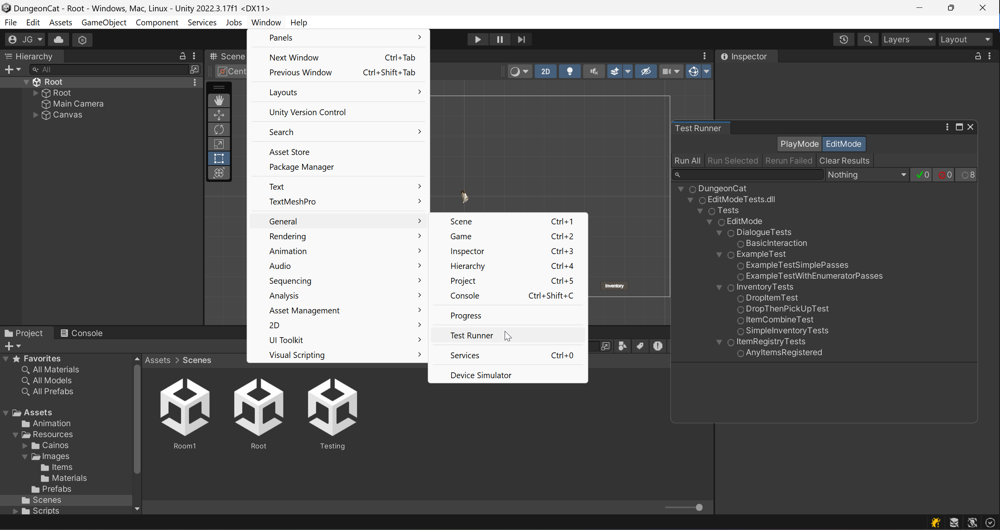

# Dungeon Cat

Dungeon Cat is a 2D top-down adventure/puzzle game based around a cat exploring a dungeon. This dungeon is filled with strange beasts, puzzles, and hidden secrets.

## Current Functionality

The majority of the core extensible components on which the entirety of the game is built are now implemented. They include:
- Basic navigation of the scene by the user with our cat avatar.
- User interaction with various entities, including structural entities (doors, walls, etc.) and items.
- User interaction with characters for dialogue.
- Inventory interactions like combining items

The only major building block we have yet to implement is the Save/Load manager, as we currently don't have enough different level progress to save. But, in preparation of that we have been specifically designing our game state data to be JSON serializable.

Of the use cases we initially outlined, the primary one that is basically functional is our tutorial use case, as the first level is what we're showing in our demo.

## Local Development

### Prerequisites: 

The Unity Editor version required for the project is [**2022.3.17f**](https://unity.com/releases/editor/qa/lts-releases#:~:text=January%209%2C%202024-,LTS%20Release,2022.3.17f1,-Released%3A%20January)

You may be asked to install the Unity Hub application to manage your Unity editor installations.

Using any other version of the editor will require a reimport of the project and is not guaranteed to work.

In terms of modules to install with the editor, Visual Studio 2022 is not required. Our preferred IDE is [JetBrains Rider](https://www.jetbrains.com/lp/dotnet-unity/).

### Instructions:
1. Download version 2022.3.17f1 of the Unity Editor, as explained above. If you have issues with installing, you can visit Unity's [troubleshooting page](https://docs.unity3d.com/Manual/TroubleShootingEditor.html)
2. Clone this repository
3. In the Unity Hub Projects section, click Add and choose the `./DungeonCat` directory (below the root of the repo)
4. Open the project and allow it to do its first initial import, which will take longer than subsequent times

### Running:

If you are within the Unity Editor and the "Root" scene is not located in your scene hierarchy on the left, then in the Unity project explorer, browse to `Assets > Scenes` and double click "Root" to load it.

To run the project, press the play button at the top middle of the Unity Editor. Press it again to stop the project.

### Testing:

To run the tests locally, from the Unity Editor top bar open `Window > General > Test Runner`. 

From that window you will be able to choose between the Edit Mode and Play Mode test tabs and run all or indivdually.

Tests can also be run through the Unit Test window of Rider, given that the project is also open in the Unity Editor.

We may eventually try to support a command line based build and test, but that is a non-standard feature among Unity projects.

### Building:

Within the Unity Editor you can do `File > Build And Run` to create a standalone build of the game.

If it asks to choose a folder for the build, just choose any directory where you want the build to output to, or create a local "build" directory (part of .gitignore)

## Repo Structure

### Unity Project

The main Unity Project is located in the `/DungeonCat` directory.

The Unity scene files that will be predominantly edited by the Scene Masters are in `/DungeonCat/Assets/Scenes`

The Unity scripts that will be predominatly edited by the Scripting Engineers are in `/DungeonCat/Assets/Scripts`

Our test suite is located in `/DungeonCat/Assets/Tests`, both `EditMode` and `PlayMode`

### Reports

Our project reports are stored in `/reports`

### CI / CD

Out GitHub actions scripts will be in `/.github/workflows` 